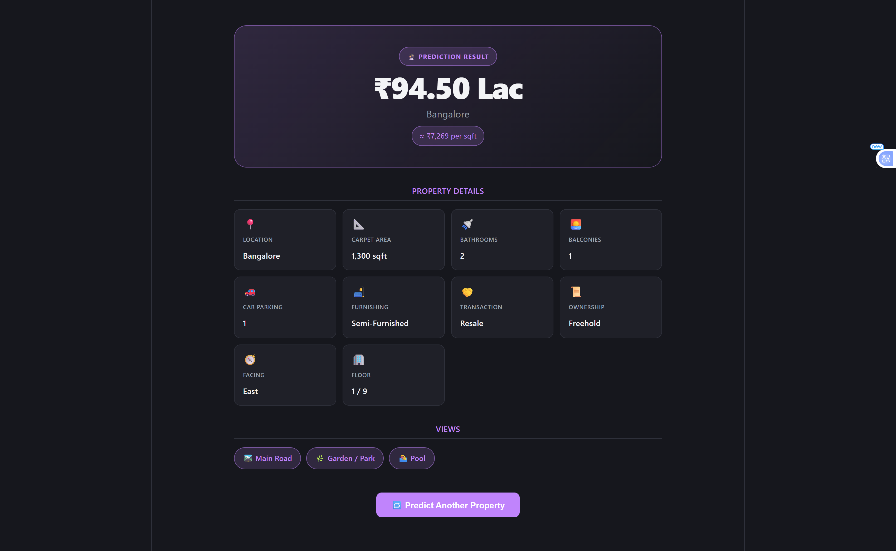

# House Price Prediction — End-to-End ML Web App

An end-to-end machine learning web application that predicts residential property prices across **51 Indian cities**. Users fill in property details through a modern React UI; the request is processed by a FastAPI backend that runs inference through a trained scikit-learn pipeline and returns an estimated price in Indian Rupees.

---

## Architecture Overview

```
┌─────────────────────────────────────────────────────────────┐
│                        BROWSER                              │
│                                                             │
│   React + TypeScript (Vite)  — localhost:5173               │
│                                                             │
│   ┌──────────────────┐     navigate("/result", {state})     │
│   │  PredictionForm  │ ──────────────────────────────────►  │
│   │  (HomePage)      │                 ResultPage           │
│   └────────┬─────────┘                                      │
└────────────│────────────────────────────────────────────────┘
             │ POST /predict  (JSON body)
             ▼
┌─────────────────────────────────────────────────────────────┐
│                       BACKEND                               │
│                                                             │
│   FastAPI (uvicorn)  — localhost:8000                       │
│                                                             │
│   GET  /locations  →  reads app/locations.json              │
│   POST /predict    →  preprocessing → sklearn Pipeline      │
│   GET  /health     →  liveness check                        │
│                                                             │
│   ┌────────────┐    ┌──────────────────────────────────┐    │
│   │ locations  │    │  sklearn Pipeline                │    │
│   │   .json    │    │  ColumnTransformer + RandomForest│    │
│   └────────────┘    │  → predicted_price (INR)         │    │
│                     └──────────────────────────────────┘    │
│                              ▲                              │
│                     models/house_price.pkl                  │
└─────────────────────────────────────────────────────────────┘
```

---

## Tech Stack

| Layer            | Technology                                |
| ---------------- | ----------------------------------------- |
| **ML / Data**    | Python 3.11, pandas, scikit-learn, NumPy  |
| **Backend API**  | FastAPI, uvicorn, pydantic-settings       |
| **Frontend**     | React 18, TypeScript, Vite                |
| **Styling**      | Vanilla CSS (custom design system)        |
| **Routing**      | React Router v6                           |
| **Model format** | scikit-learn Pipeline (`.pkl` via joblib) |

---

## Project Structure

```
HousePricePrediction/
│
├── backend/
│   ├── app/
│   │   ├── api/
│   │   │   └── routes/
│   │   │       └── prediction.py   # GET /locations, POST /predict, GET /health
│   │   ├── core/
│   │   │   └── config.py           # Settings (pydantic-settings, .env)
│   │   ├── schemas/
│   │   │   └── prediction.py       # PredictionRequest / PredictionResponse
│   │   ├── services/
│   │   │   ├── inference.py        # Model loading & predict()
│   │   │   └── preprocessing.py    # build_dataframe()
│   │   ├── utils/
│   │   │   └── logging_config.py
│   │   ├── locations.json          # 51 valid city slugs
│   │   └── main.py                 # FastAPI app + lifespan (model load)
│   ├── tests/
│   ├── .env.example
│   └── requirements.txt
│
├── frontend/
│   ├── src/
│   │   ├── api/
│   │   │   └── predictionClient.ts # fetchLocations(), predictPrice()
│   │   ├── components/
│   │   │   └── PredictionForm.tsx  # Main input form
│   │   ├── pages/
│   │   │   ├── HomePage.tsx        # Hosts form + handles navigation
│   │   │   ├── ResultPage.tsx      # Displays prediction result
│   │   │   └── NotFoundPage.tsx
│   │   ├── types/
│   │   │   └── prediction.ts       # TypeScript interfaces
│   │   ├── App.tsx                 # BrowserRouter + Routes
│   │   └── style.css
│   ├── .env
│   ├── .env.example
│   └── vite.config.ts
│
├── models/
│   └── house_price.pkl             # Trained sklearn Pipeline (not in git)
│
├── notebooks/
│   └── *.ipynb                     # EDA, feature engineering, training
│
└── README.md
```

---

## Dataset

**House Price Prediction** by **Juhi Bhojani** — available on Kaggle.

🔗 [https://www.kaggle.com/datasets/juhibhojani/house-price](https://www.kaggle.com/datasets/juhibhojani/house-price)

The dataset contains ~176,000 residential property listings across 81 Indian cities with features such as carpet area, number of bathrooms, balconies, furnishing status, transaction type, ownership type, floor, facing direction, and overlooking views.

### Download Instructions

1. Install the Kaggle CLI:

   ```bash
   pip install kaggle
   ```

2. Place your `kaggle.json` API token in `~/.kaggle/kaggle.json`.

3. Download the dataset:

   ```bash
   kaggle datasets download -d juhibhojani/house-price --unzip -p data/
   ```

4. The raw CSV will be available at `data/House Price India.csv`.  
   Run the notebooks in `notebooks/` to reproduce preprocessing and model training.

---

## Running the Backend

### Prerequisites

- Python 3.10+
- A trained model file at `models/house_price.pkl`  
  _(run the training notebook first, or copy a pre-trained `.pkl` into that path)_

### Steps

```bash
# 1. Create and activate a virtual environment
cd backend
python -m venv .venv

# Windows
.\.venv\Scripts\activate
# macOS / Linux
source .venv/bin/activate

# 2. Install dependencies
pip install -r requirements.txt

# 3. Copy and configure environment variables
copy .env.example .env        # Windows
# cp .env.example .env        # macOS / Linux

# 4. Start the development server
python -m uvicorn app.main:app --reload --port 8000
```

The API will be available at **http://localhost:8000**  
Interactive Swagger docs: **http://localhost:8000/docs**

---

## Running the Frontend

### Prerequisites

- Node.js 18+

### Steps

```bash
# 1. Install dependencies
cd frontend
npm install

# 2. Copy and configure environment variables
copy .env.example .env        # Windows
# cp .env.example .env        # macOS / Linux

# 3. Start the Vite dev server
npm run dev
```

The app will be available at **http://localhost:5173**

> **Start the backend first** — the frontend fetches the locations list on page load and calls `/predict` on form submit.

---

## Environment Variables

### Backend — `backend/.env`

| Variable         | Default                                             | Description                                                |
| ---------------- | --------------------------------------------------- | ---------------------------------------------------------- |
| `LOG_LEVEL`      | `INFO`                                              | Logging verbosity (`DEBUG` / `INFO` / `WARNING` / `ERROR`) |
| `MODEL_PATH`     | `<project_root>/models/house_price.pkl`             | Absolute path to the trained `.pkl` file                   |
| `LOCATIONS_PATH` | `<backend>/app/locations.json`                      | Absolute path to the locations JSON array                  |
| `CORS_ORIGINS`   | `["http://localhost:5173","http://localhost:3000"]` | Allowed CORS origins (JSON array string)                   |

### Frontend — `frontend/.env`

| Variable            | Default                 | Description                     |
| ------------------- | ----------------------- | ------------------------------- |
| `VITE_API_BASE_URL` | `http://localhost:8000` | Base URL of the FastAPI backend |

---

## API Reference

### `GET /health`

Returns the server liveness status and whether the model is loaded.

```bash
curl http://localhost:8000/health
```

```json
{ "status": "ok", "model_loaded": true }
```

---

### `GET /locations`

Returns the list of 51 city slugs the model was trained on.

```bash
curl http://localhost:8000/locations
```

```json
{
  "locations": [
    "agra",
    "ahmedabad",
    "bangalore",
    "chennai",
    "hyderabad",
    "jaipur",
    "kolkata",
    "mumbai",
    "new-delhi",
    "pune",
    "..."
  ]
}
```

---

### `POST /predict`

Accepts property details and returns an estimated price.

**Request body:**

| Field              | Type      | Example            | Notes                                                                               |
| ------------------ | --------- | ------------------ | ----------------------------------------------------------------------------------- |
| `location`         | `string`  | `"mumbai"`         | Must be a valid slug from `/locations`                                              |
| `area_sqft`        | `number`  | `1200`             | Carpet area in square feet                                                          |
| `current_floor`    | `integer` | `3`                | 0 = ground floor                                                                    |
| `total_floors`     | `integer` | `10`               | ≥ 1                                                                                 |
| `bathroom_num`     | `integer` | `2`                |                                                                                     |
| `balcony_num`      | `integer` | `1`                |                                                                                     |
| `car_parking_num`  | `integer` | `1`                |                                                                                     |
| `view_main_road`   | `0 \| 1`  | `0`                |                                                                                     |
| `view_garden_park` | `0 \| 1`  | `1`                |                                                                                     |
| `view_pool`        | `0 \| 1`  | `0`                |                                                                                     |
| `furnishing`       | `string`  | `"Semi-Furnished"` | `Furnished` / `Semi-Furnished` / `Unfurnished` / `Unknown`                          |
| `transaction`      | `string`  | `"Resale"`         | `Resale` / `New Property` / `Other`                                                 |
| `ownership`        | `string`  | `"Freehold"`       | `Freehold` / `Leasehold` / `Co-operative Society` / `Power Of Attorney` / `Unknown` |
| `facing`           | `string`  | `"East"`           | Cardinal / intercardinal direction, or `Unknown`                                    |

**Example `curl` call:**

```bash
curl -s -X POST http://localhost:8000/predict \
  -H "Content-Type: application/json" \
  -d '{
    "location": "mumbai",
    "area_sqft": 1200,
    "current_floor": 5,
    "total_floors": 15,
    "bathroom_num": 2,
    "balcony_num": 1,
    "car_parking_num": 1,
    "view_main_road": 0,
    "view_garden_park": 1,
    "view_pool": 0,
    "furnishing": "Semi-Furnished",
    "transaction": "Resale",
    "ownership": "Freehold",
    "facing": "East"
  }'
```

**Response:**

```json
{
  "predicted_price": 18500000.0,
  "price_display": "₹1.85 Cr",
  "location": "mumbai",
  "area_sqft": 1200
}
```

> Unknown locations are automatically mapped to `"other"` — no 422 error is raised.

---

## Model Performance

The final model is a **Random Forest Regressor** wrapped inside a scikit-learn `Pipeline` with a `ColumnTransformer` for preprocessing (one-hot encoding + standard scaling).

**Hyperparameters:**

```python
RandomForestRegressor(
    n_estimators=200,
    max_depth=15,
    min_samples_leaf=5,
    n_jobs=-1,
    random_state=42
)
```

Evaluated on a held-out test set (20% of ~176k listings):

| Metric                                | Value      |
| ------------------------------------- | ---------- |
| **MAE** (Mean Absolute Error)         | ₹1,071,221 |
| **RMSE** (Root Mean Squared Error)    | ₹2,725,363 |
| **R²** (Coefficient of Determination) | **0.9293** |

---

## Screenshots

### Home — Prediction Form



### Result Page — Price Estimate


---

## License

This project is for educational purposes.  
Dataset credit: **Juhi Bhojani** on Kaggle.
